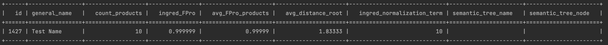
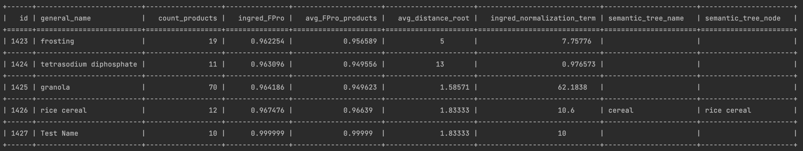
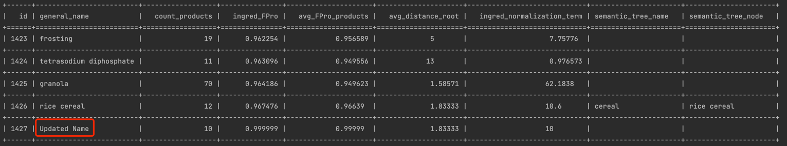
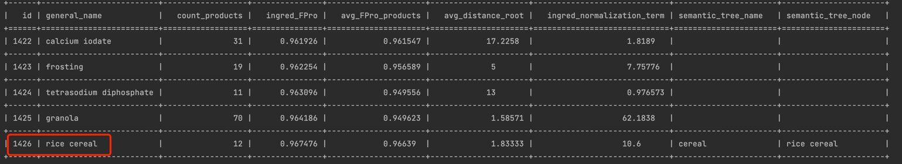
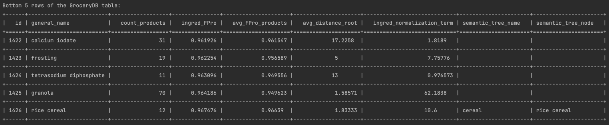
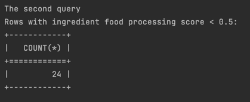

# Python Script interacting with SQL Database

[](https://github.com/nogibjj/IDS706-MiniProject5-Sqlite/actions/workflows/cicd.yml)

## Goal

> Duke University IDS 706 Weekly Mini Project 5

This project mainly is:
- Connect to a SQL database
- Perform CRUD operations
- Write at least two different SQL queries

In addition, I make use of Grocery dataset to do the CRUD operations.
To realise all requirements, I add an additional row with index 1427.

## Preparation

1. make sure a data.csv file is in the same directory as main.py
2. Python 3 or above
3. Grocery DB extracted by `extract.py`
4. tabulate is used to format the output

## Run and Result

### Run
use
`python main.py`

Upon running the script, it will create database and do the CRUD operations as well as 2 query.

### Result

#### Connection

```python
conn = sqlite3.connect('GroceryDB.db')
c = conn.cursor()
```

#### Create and Insert
> In transform_load.py
```python
c.execute("DROP TABLE IF EXISTS GroceryDB")
c.execute("CREATE TABLE GroceryDB ("
              "id INTEGER PRIMARY KEY ,"
              "general_name, "
              "count_products, "
              "ingred_FPro, "
              "avg_FPro_products, "
              "avg_distance_root, "
              "ingred_normalization_term, "
              "semantic_tree_name, "
              "semantic_tree_node)")
```

```python
c.execute("INSERT INTO GroceryDB VALUES (1427, 'Market', 10, 0.999999, 0.99999, 1.83333, 10.0, '', '')")
```


#### Read
> Full codes in  query.py of `read` function
```python
c.execute("SELECT * FROM Grocery")
print(c.fetchall())
```


#### Update
> Full codes in  query.py of `update` function
```python
c.execute("UPDATE GroceryDB SET general_name = 'Updated Name' WHERE id = 1427")
```



#### Delete

> Full codes in  query.py of `delete` function
```python
c.execute("DELETE FROM GroceryDB WHERE id = 1427")
```



## query 1
> list the bottom 5 rows of the GroceryDB table



## query 2
> ingredient food processing score < 0.5 which means less processed



## Test

use 
`make test` or `python test_main.py` to test the script

## Reference

1. https://github.com/nogibjj/sqlite-lab
2. https://github.com/Barabasi-Lab/GroceryDB